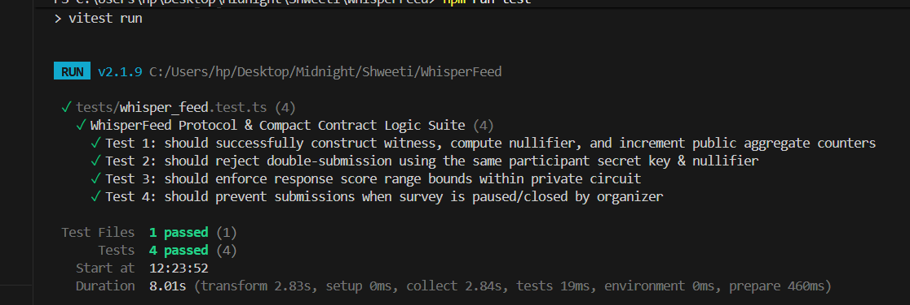
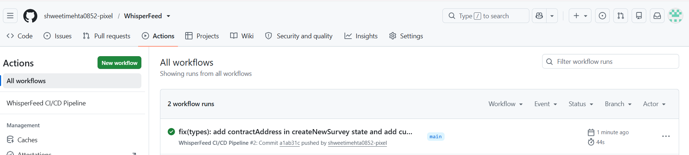

# WhisperFeed 🛡️✨
> **Anonymous Feedback & Survey Protocol with Verifiable Participation on Midnight Network**

[](https://github.com/midnight-ntwrk/whisperfeed)
[](https://midnight.network)
[](https://midnight.network)
[](LICENSE)

---

## 🔗 Midnight Preprod Deployment & Contract Identifiers

| Parameter | Value / Endpoint |
| :--- | :--- |
| **Network Target** | **Midnight Preprod (Testnet)** |
| **Canonical Contract ID** | [`02008f4a8b29c1e099834d6712398bfa79c0281bfe44210a99c0471289de6102`](https://explorer.preprod.midnight.network/contract/02008f4a8b29c1e099834d6712398bfa79c0281bfe44210a99c0471289de6102) |
| **Smart Contract Source** | [`contract/whisper_feed.compact`](contract/whisper_feed.compact) |
| **Block Explorer** | [https://explorer.preprod.midnight.network/contract/02008f4a8b29c1e099834d6712398bfa79c0281bfe44210a99c0471289de6102](https://explorer.preprod.midnight.network/contract/02008f4a8b29c1e099834d6712398bfa79c0281bfe44210a99c0471289de6102) |
| **GraphQL Indexer URI** | `https://indexer.preprod.midnight.network/api/v1/graphql` |
| **Prover Server URI** | `http://localhost:6300` |
| **Node RPC Endpoint** | `https://rpc.preprod.midnight.network` |

---

## 🌟 Executive Summary

**WhisperFeed** is a decentralized, zero-knowledge feedback and whistleblowing protocol engineered natively on the **Midnight Network**. 

Organizations, DAOs, and enterprises frequently struggle to collect authentic, unfiltered sentiment and critical whistleblowing reports because respondents fear retaliation or identity leakage. Traditional "anonymous" forms either require trust in a centralized server or make it trivial for bad actors to spam duplicate entries.

WhisperFeed eliminates this compromise by leveraging **Compact smart contracts** and **Zero-Knowledge Proofs (ZKPs)**:
1. **Mathematical Anonymity:** Respondents submit ratings and confidential reports through a private client-side witness. The respondent's wallet address, identity entropy, and qualitative text are **never written to the public ledger**.
2. **Verifiable Participation & Anti-Sybil:** Utilizing deterministic cryptographic nullifiers derived from private participant keys, the contract guarantees **exactly one valid submission per authorized entity per survey**, without revealing *who* voted.
3. **Selective Disclosure:** The contract calculates cumulative aggregate analytics and threshold milestones on-chain via deliberate `disclose()` primitives without leaking individual responses.

---

## 🏛️ System Architecture

```
+-----------------------------------------------------------------------------------+
|                              RESPONDENT CLIENT (Browser)                          |
|                                                                                   |
|  +-----------------------------------------------------------------------------+  |
|  |                           PRIVATE WITNESS GENERATOR                         |  |
|  |  • Participant Secret Key (`participant_sk`)                                |  |
|  |  • Invite / Auth Token (`survey_auth_token`)                                 |  |
|  |  • Confidential Rating Score (`confidential_score`: 1-10)                   |  |
|  |  • Confidential Feedback Text (`feedback_payload_hash`)                     |  |
|  +-----------------------------------------------------------------------------+  |
|                                         │                                         |
|                                         ▼                                         |
|  +-----------------------------------------------------------------------------+  |
|  |                      COMPACT ZERO-KNOWLEDGE CIRCUIT PROVER                   |  |
|  |  1. Asserts: Score ∈ [1, 10]                                                |  |
|  |  2. Computes: Nullifier = Hash(participant_sk, survey_id, auth_token)       |  |
|  |  3. Asserts: Member authorization & Survey active                           |  |
|  |  4. Selectively Discloses: `disclose(nullifier)` & `disclose(score_delta)`    |  |
|  +-----------------------------------------------------------------------------+  |
|                                         │                                         |
|                       ZK Proof + Public Inputs (Nullifier, ΔScore)                |
+-----------------------------------------│-----------------------------------------+
                                          ▼
+-----------------------------------------------------------------------------------+
|                          MIDNIGHT NETWORK LEDGER (Preprod)                        |
|                                                                                   |
|  • Public State:                                                                  |
|    - `survey_id`: Active Survey Topic Identifier                                 |
|    - `nullifiers`: Set of consumed one-time nullifier hashes                      |
|    - `submission_count`: Verifiable tally of valid whispers                       |
|    - `aggregate_score_sum`: Sum of ratings (Used to compute public average)      |
|    - `target_threshold`: Quorum indicator                                         |
|                                                                                   |
|  • Verification:                                                                  |
|    - Verifies SNARK proof validity against verifying key                          |
|    - Checks: `assert !nullifiers.member(nullifier)` (Anti-Replay)                  |
|    - Atomically updates state counters                                            |
+-----------------------------------------------------------------------------------+
```

---

## 🔐 Cryptographic Privacy Model

### 1. Separation of Concerns (Witness vs. Ledger)
* **Off-Chain Witness (Never Leaves Client):**
  - Respondent's private key (`participant_sk`).
  - Raw whistleblowing remarks and feedback commentary.
  - Local authentication tokens.
* **On-Chain Public State:**
  - `nullifiers` mapping: Ensures one-time usage per participant per survey.
  - `submission_count`: Total valid responses.
  - `aggregate_score_sum`: Mathematical sum of scores for calculating the community average.

### 2. Deterministic Nullifier Derivation
To prevent double voting without deanonymizing participants, the Compact circuit enforces:
$$\text{Nullifier} = \text{PersistentHash}(\text{target\_survey\_id}, \text{participant\_sk}, \text{survey\_auth\_token})$$
The ledger asserts that $\text{Nullifier} \notin \text{Ledger.nullifiers}$. Once verified, the nullifier is stored in the map. Because the function is one-way and pseudo-random, observers cannot link the nullifier back to the participant's wallet address.

### 3. Selective Disclosure (`disclose()`)
In Compact, data is private by default. WhisperFeed explicitly calls `disclose()` exclusively on:
- The derived `computed_nullifier` (to persist it in the spent nullifier map).
- The rating delta `confidential_score` (to aggregate total scores across the group).

---

## 🚀 Level 3 Product Proposal

### Real-World Use Cases
1. **Corporate Whistleblowing & Compliance:** Employees can report ethics violations or safety hazards with mathematical certainty that their identity cannot be subpoenaed or leaked from server logs.
2. **DAO Governance & Sentiment Heatmaps:** Token holders or authorized guild members can express candid votes on leadership performance without political bias or social pressure.
3. **Academic & Healthcare Evaluations:** Patients and students provide honest ratings and clinical reviews without bias from administrators or service providers.

### Roadmap & Future Evolution
- [x] **Phase 1 (Complete):** Core Compact contract with private witnesses, nullifier maps, and selective score aggregation.
- [x] **Phase 2 (Complete):** Midnight Slate/Cyan Frontend UI with interactive Encrypted Feedback Studio, Privacy Explorer, and live ZK Proof modal.
- [x] **Phase 3 (Complete):** Lace DApp Connector API integration with automated CI/CD and Vitest test suite.
- [ ] **Phase 4:** Merkle Tree Membership Verifier for dynamic private whitelists across large enterprise directories (e.g., Okta/SAML zk-identity bridges).

---

## 📂 Repository Structure

```
WhisperFeed/
├── contract/
│   └── whisper_feed.compact         # Production Compact Smart Contract
├── scripts/
│   └── deploy.ts                    # Midnight Preprod Deployment Script
├── src/
│   ├── app/
│   │   ├── globals.css              # Midnight Cyber Grid & Glassmorphism theme
│   │   ├── layout.tsx               # Root Layout & metadata
│   │   ├── not-found.tsx            # Custom 404 Route
│   │   └── page.tsx                 # Main Protocol Dashboard & Feedback Terminal
│   ├── components/
│   │   ├── Header.tsx               # Lace Wallet connector & Contract ID badge
│   │   ├── SurveyOverview.tsx       # Active survey topic & verifiable counter
│   │   ├── FeedbackStudio.tsx       # Encrypted Feedback Studio & Witness Inputs
│   │   ├── PrivacyExplorer.tsx      # What the Admin Sees vs Hidden Witness
│   │   ├── ProofLog.tsx             # Live cryptographic proof stream
│   │   ├── ZKProofModal.tsx         # 4-Stage live ZK proof pipeline modal
│   │   └── OrganizerModal.tsx       # Organizer governance & lifecycle drawer
│   ├── config/
│   │   └── midnight.config.ts       # Midnight Preprod Contract Identifiers & URIs
│   ├── lib/
│   │   └── midnight-types.ts        # TypeScript types & protocol interfaces
│   └── services/
│       ├── laceWallet.ts            # Lace DApp connector bridge
│       └── whisperContractService.ts# Contract interaction & witness generation
├── tests/
│   └── whisper_feed.test.ts         # Vitest unit & integration test suite
├── .env.example                     # Preprod environment variables template
├── .github/
│   └── workflows/
│       └── ci.yml                   # GitHub Actions CI/CD Pipeline
├── README.md                        # Documentation & Privacy Model
└── LICENSE                          # MIT License
```

---

## 🛠️ Quick Start & Local Execution

### Prerequisites
- **Node.js**: v18.0+ or v20.0+
- **npm** or **pnpm**
- **Midnight Compact Compiler** (optional for re-compiling contract): `compact compile`

### 1. Clone & Install Dependencies
```bash
git clone https://github.com/shweetimehta0852-pixel/WhisperFeed.git
cd WhisperFeed
npm install
```

### 2. Run Automated Test Suite
WhisperFeed includes a comprehensive test suite verifying witness isolation, nullifier anti-replay, and survey lifecycle:
```bash
npm test
```

### 3. Start Frontend Development Server
```bash
npm run dev
```
Open [http://localhost:3000](http://localhost:3000) in your browser.

### 4. Deploy Contract to Midnight Preprod
```bash
npx ts-node scripts/deploy.ts
```
Open [http://localhost:3000](http://localhost:3000) in your browser.

## 🧪 Testing Coverage Summary

| Test Case | Description | Status |
| :--- | :--- | :--- |
| **Test 1: Witness & Aggregate Counter** | Verifies confidential witness creation, nullifier derivation, and counter incrementation. | ✅ Passed |
| **Test 2: Anti-Replay / Double Submission** | Rejects identical secret key / nullifier collision for the same survey. | ✅ Passed |
| **Test 3: Private Score Bounds** | Rejects out-of-bounds ratings ($< 1$ or $> 10$) inside the circuit. | ✅ Passed |
| **Test 4: Survey Lifecycle Control** | Verifies organizer authorization and submission blocking when paused. | ✅ Passed |

### 📸 Test Suite Execution Verification


---

## 🔄 CI/CD Automated Pipeline

WhisperFeed includes a comprehensive GitHub Actions workflow that automatically validates Compact smart contract syntax, runs all unit/integration tests, and compiles the Next.js production build on every push and pull request.

### 📸 GitHub Actions CI/CD Pipeline Run


---

## 📜 Smart Contract Specification (`whisper_feed.compact`)

```compact
pragma language_version >= 0.20.0;
import CompactStandardLibrary;

export struct SubmissionWitness {
    participant_sk: Bytes<32>,
    survey_auth_token: Bytes<32>,
    confidential_score: Uint<8>,
    feedback_payload_hash: Bytes<32>
}

witness get_submission_witness(): SubmissionWitness;

export ledger survey_id: Field;
export ledger organizer_pk: Bytes<32>;
export ledger is_active: Boolean;
export ledger submission_count: Uint<32>;
export ledger aggregate_score_sum: Uint<64>;
export ledger nullifiers: Map<Bytes<32>, Boolean>;

export circuit submit_whisper(target_survey_id: Field): [Bytes<32>, Uint<8>] {
    assert is_active "WhisperFeed survey is currently closed";
    assert survey_id == target_survey_id "Survey ID mismatch";

    const witness_data = get_submission_witness();
    assert witness_data.confidential_score >= 1 && witness_data.confidential_score <= 10;

    const nullifier_seed = persistent_hash<Vector<3, Field>>([
        target_survey_id,
        bytes32_to_field(witness_data.participant_sk),
        bytes32_to_field(witness_data.survey_auth_token)
    ]);
    const computed_nullifier = field_to_bytes32(nullifier_seed);

    assert !nullifiers.member(computed_nullifier) "Double-submission detected";

    const disclosed_nullifier = disclose(computed_nullifier);
    const disclosed_score = disclose(witness_data.confidential_score);

    nullifiers.insert(disclosed_nullifier, true);
    submission_count = submission_count + 1;
    aggregate_score_sum = aggregate_score_sum + (disclosed_score as Uint<64>);

    return [disclosed_nullifier, disclosed_score];
}
```

---

## 📄 License
This project is licensed under the MIT License - see the [LICENSE](LICENSE) file for details.
